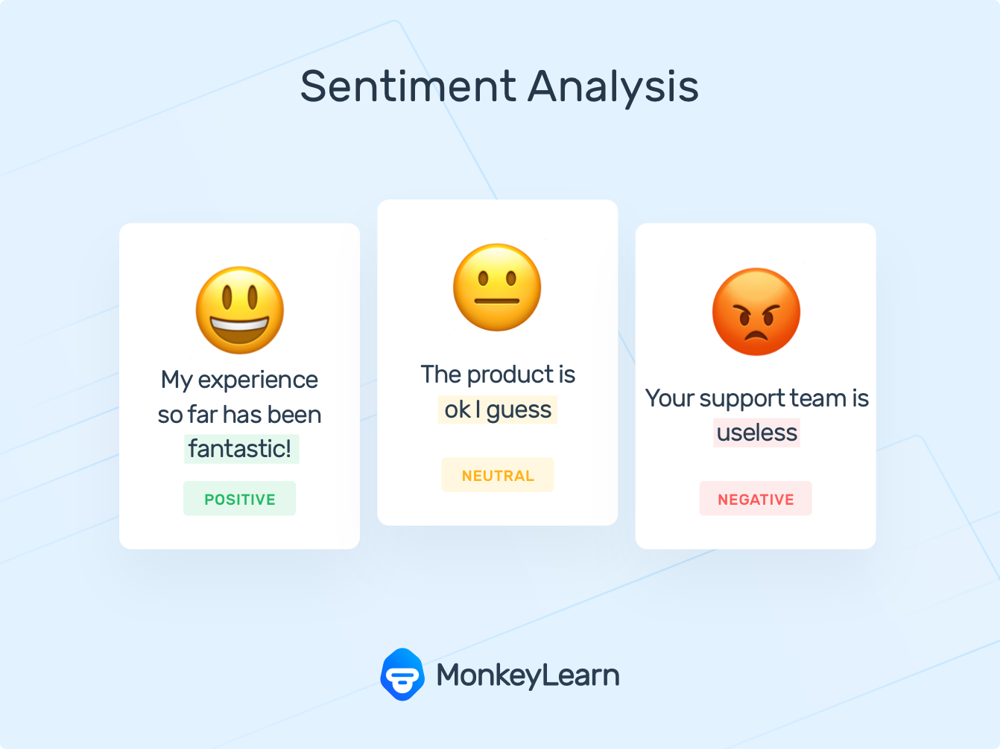

# Text-Mining

Text Analytics 

1. Topic Analyxer
2. Sentiment Analyzer
3. Feature Extractor 

Types of Sentimental Analysis

1. Five Grind Sentiment 
2. Multilingual Sentiment 
3. Emotion Sentiment 
4. Aspect based Sentiment Analysis 

why perform Sentiment Analysis ?
1. Sentiment analysis helps businesses process huge amounts of data in an efficient and cost-effective way.
2. Real-Time Analysis Sentiment analysis -- Is an angry customer about to churn Sentiment analysis models can help you immediately identify these kinds of situations and gauge brand sentiment, so you can take action right away.
3. Consistent results 

Sentiment Analysis Algorithms

1. Rule based algorithm 
2. Machine learning 
3. Hybrid -- Rule based and Machine learning 

1. RUle based algorithm 

predefined set of positive and negative words given input text document and counting number of positive and negative sentiments. later deciding positive, negative or neutral sentiments

2. Machine learning Algorithm 

 1. Naive Bayes
 2. Linear Regression 
 3. Deep learning 
 
 
 
 It was the best of times,
it was the worst of times,
it was the age of wisdom,
it was the age of foolishness

Sentiment analysis Challenges

1. Subjectivity and Tone
2. Context and Polarity
3. Irony and Sarcasm
4. Comparisons
5. Emojis

Sentiment Analysis Applications 

1. Social media monitoring
2. Brand monitoring
3. Voice of customer (VoC)
4. Customer service
5. Market research

Keyword extraction

Collecting informative or important words in a text. It helps summarize the content of a text and recognize the main topics which are being discussed.

First Doing Sentiment analysis dividing into positive, Negative and Neutral sentiments and then performing keyword extraction on following.

keyword Analysis Techniques:

1. TF-IDF 
2. Rapid Automatic Keyword Extraction
3. Linguistic approaches
4. Graph Based approach
5. Machine learning based approach
6. Hybrid approach 

1. TF-IDF -  

